# Node.js — Async Operations, libuv, Buffers & Streams

## 📚 What You'll Learn

This guide covers **how Node.js handles asynchronous operations behind the scenes**:

✅ Three ways to use fs module: callbacks, promises, async/await  
✅ How libuv makes Node.js non-blocking  
✅ Thread pool and event loop architecture  
✅ What buffers are and how they work  
✅ What streams are and why they save memory  
✅ Complete flow diagrams for async operations

**Best for:** Understanding Node.js internals, interview preparation, advanced Node.js concepts

---

## Table of Contents

1. [Three Ways to Use fs Module (Async)](#1-three-ways-to-use-fs-module-async)
2. [The Problem with Callbacks — Callback Hell](#2-the-problem-with-callbacks--callback-hell)
3. [fs/promises — Cleaner Async](#3-fspromises--cleaner-async)
4. [async/await — The Modern Way](#4-asyncawait--the-modern-way)
5. [libuv — The Heart of Node.js Async](#5-libuv--the-heart-of-nodejs-async)
6. [Thread Architecture in Node.js](#6-thread-architecture-in-nodejs)
7. [The 6 Queues in Node.js](#7-the-6-queues-in-nodejs)
8. [Complete Async Operation Flow](#8-complete-async-operation-flow)
9. [Buffers — Temporary Data Storage](#9-buffers--temporary-data-storage)
10. [Streams — Processing Large Files Efficiently](#10-streams--processing-large-files-efficiently)
11. [Buffer vs Streams — When to Use Which](#11-buffer-vs-streams--when-to-use-which)
12. [Summary](#12-summary)
13. [Revision Checklist](#13-revision-checklist)

---

## 1. Three Ways to Use fs Module (Async)

Node.js gives you **three different patterns** to handle asynchronous file operations. They all do the same thing, but with different syntax.

### Pattern Evolution

```
Callbacks (2009)  →  Promises (2015)  →  async/await (2017)
   ↓                     ↓                      ↓
 Complex            Better              Best (Modern)
```

---

### 1.1 Method 1: Callbacks (Original Way)

```javascript
import fs from "node:fs";

console.log(1);

fs.readFile("./fs.html", "utf-8", (err, payload) => {
  if (err) console.log(err);
  console.log("payload:", payload);
});

console.log(2);
console.log(3);

// Output: 1 → 2 → 3 → "payload: [file content]"
```

**How it works:**

1. Call `readFile()` with a callback function
2. Node.js starts reading the file in the background
3. Execution continues (prints 2, 3)
4. When file reading is done, the callback fires

---

### 1.2 Method 2: Promises (then/catch)

```javascript
import fsP from "node:fs/promises";

console.log(1);

fsP
  .readFile("./fs.js", "utf-8")
  .then((payload) => {
    console.log("payload:", payload);
    console.log("file read");
  })
  .catch((err) => {
    console.log("error while reading");
  });

console.log(2);
console.log(3);

// Output: 1 → 2 → 3 → "payload: [file content]" → "file read"
```

**Advantages over callbacks:**

- Cleaner error handling (one `.catch()` instead of `if (err)` everywhere)
- Better chaining for multiple operations

---

### 1.3 Method 3: async/await (Modern Way — Best)

```javascript
import fsP from "node:fs/promises";

async function fsOP() {
  await fsP.writeFile("./server.js", "this is server");
  console.log("1");

  await fsP.appendFile("./server.js", "app1");
  console.log("2");

  await fsP.appendFile("./server.js", "app2");
  console.log("3");
}

fsOP();

// Output: "1" → "2" → "3" (in order!)
```

**Why this is best:**

- Reads like synchronous code (top-to-bottom)
- No nesting or `.then()` chains
- Easy to understand and maintain

---

### Quick Comparison

| Pattern         | Pros                  | Cons                        | Use When                  |
| --------------- | --------------------- | --------------------------- | ------------------------- |
| **Callbacks**   | Universal support     | Callback hell, hard to read | Legacy code only          |
| **Promises**    | Better than callbacks | Still has `.then()` chains  | Need Promise object       |
| **async/await** | Cleanest syntax       | Requires `async` function   | Modern code (recommended) |

---

## 2. The Problem with Callbacks — Callback Hell

### What is Callback Hell?

When you need to do **multiple async operations in sequence**, callbacks get nested deeper and deeper — making code hard to read.

```javascript
// ❌ BAD — Callback Hell (Pyramid of Doom)
fs.writeFile("./demo.txt", "new data", (err) => {
  if (err) {
    console.log("error while creating a file");
    return;
  }
  console.log("file created");

  fs.appendFile("./demo.txt", "data 1", (err) => {
    if (err) {
      console.log("error while updating 1");
      return;
    }
    console.log("file updated 1");

    fs.appendFile("./demo.txt", "data 2", (err) => {
      if (err) {
        console.log("error while updating 2");
        return;
      }
      console.log("file updated 2");

      // Imagine 10 more levels deep...
    });
  });
});
```

**Problems:**

- Hard to read (indentation goes crazy)
- Hard to debug
- Hard to add error handling
- Hard to maintain

---

### The Problem Visualized

```
Operation 1
  └─► Operation 2
       └─► Operation 3
            └─► Operation 4
                 └─► Operation 5
                      └─► Operation 6  ← Too deep!
```

---

### The Fix: Promises or async/await

```javascript
// ✅ GOOD — async/await (Flat Structure)
async function fsOP() {
  try {
    await fsP.writeFile("./demo.txt", "new data");
    console.log("file created");

    await fsP.appendFile("./demo.txt", "data 1");
    console.log("file updated 1");

    await fsP.appendFile("./demo.txt", "data 2");
    console.log("file updated 2");
  } catch (err) {
    console.log("error:", err);
  }
}

fsOP();
```

**Benefits:**

- Flat structure (no deep nesting)
- One `try/catch` for all errors
- Easy to read top-to-bottom

---

## 3. fs/promises — Cleaner Async

### How to Import

```javascript
// Method 1: ESM (Recommended)
import fsP from "node:fs/promises";

// Method 2: CommonJS
const fsP = require("node:fs/promises");

// Method 3: Alternative CommonJS
const fsP = require("node:fs").promises;
```

---

### All Methods Return Promises

```javascript
import fsP from "node:fs/promises";

// writeFile — Returns a Promise
let writePromise = fsP.writeFile("./example.py", "this is data");

writePromise
  .then((data) => {
    console.log("file created");
    // Next logic here
  })
  .catch((err) => {
    console.log("error while creating a file");
    console.log(err);
  })
  .finally(() => {
    console.log("finally block always runs");
  });
```

---

### Avoiding Promise Hell (Yes, It Exists Too!)

```javascript
// ❌ BAD — Promise Hell (still nested)
let write = fsP.writeFile("./app.js", "data");
write
  .then(() => {
    console.log("file created");

    let update = fsP.appendFile("./app.js", "more data");
    update
      .then(() => {
        console.log("file appended");

        let update2 = fsP.appendFile("./app.js", "even more");
        update2
          .then(() => {
            console.log("file appended 2");
          })
          .catch();
      })
      .catch();
  })
  .catch();
```

**Solution:** Use async/await or Promise chaining

---

## 4. async/await — The Modern Way

### The Complete Pattern

```javascript
import fsP from "node:fs/promises";

async function fsOP() {
  try {
    // All operations run in sequence
    await fsP.writeFile("./server.js", "this is server");
    console.log("1 - file created");

    await fsP.appendFile("./server.js", "app1");
    console.log("2 - first append done");

    await fsP.appendFile("./server.js", "app2");
    console.log("3 - second append done");
  } catch (err) {
    console.log("Error occurred:", err);
  }
}

fsOP();
```

---

### Why async/await Wins

| Feature            | async/await      | Callbacks       | Promises        |
| ------------------ | ---------------- | --------------- | --------------- |
| **Readability**    | ✅ Excellent     | ❌ Poor         | ⚠️ Okay         |
| **Error handling** | ✅ One try/catch | ❌ Many if(err) | ✅ One .catch() |
| **Debugging**      | ✅ Easy          | ❌ Hard         | ⚠️ Moderate     |
| **Nesting**        | ✅ None          | ❌ Deep         | ⚠️ Some         |
| **Modern**         | ✅ Yes           | ❌ Old          | ⚠️ Okay         |

---

## 5. libuv — The Heart of Node.js Async

### What is libuv?

**Simple explanation:** libuv is a **C library** that makes Node.js non-blocking. It's the "worker team" that handles all the heavy I/O work in the background while JavaScript keeps running.

Think of it like this:

- **You (JavaScript)** → The boss giving orders
- **libuv** → The team of workers doing the actual work
- **Event Loop** → The manager coordinating everything

---

### The Complete Architecture

```
┌────────────────────────────────────────────────────────────────┐
│                        Node.js Runtime                         │
│                                                                │
│  ┌─────────────────┐         ┌───────────────────────────┐   │
│  │  Call Stack     │         │      libuv (C, C++)       │   │
│  │  (C++)          │         │                           │   │
│  │                 │         │  • File reading           │   │
│  │  Thread(main)   │◄───────►│  • DB calls               │   │
│  │                 │         │  • Network calls          │   │
│  │  op             │         │  • Timers                 │   │
│  │  1              │         │                           │   │
│  │  2              │         │  Event Loop (manager)     │   │
│  │  3              │         │  ├─ 4 threads (workers)   │   │
│  │  data/error     │         │  └─ 6 queues              │   │
│  └─────────────────┘         └───────────────────────────┘   │
│                                                                │
│  Main thread executes sync code only                          │
│  Main thread offloads async operations to system kernel       │
│  If kernel can't handle it → libuv handles it                 │
└────────────────────────────────────────────────────────────────┘
```

---

### What libuv Does

| Task                | Description                     |
| ------------------- | ------------------------------- |
| **File I/O**        | Reading/writing files           |
| **Database calls**  | Queries to MongoDB, MySQL, etc. |
| **Network calls**   | HTTP requests, API calls        |
| **Timers**          | `setTimeout`, `setInterval`     |
| **DNS resolution**  | Looking up domain names         |
| **Child processes** | Spawning other programs         |

> 💡 **Key point:** libuv handles ALL async I/O operations — not just file operations!

---

### The Delegation Process


**Step-by-step:**

1. You call `fs.readFile()`
2. Main thread delegates it
3. System kernel checks: Can I handle this?
   - **If yes** → Kernel does it (very fast)
   - **If no** → libuv thread pool does it
4. When done, result goes to Event Loop
5. Event Loop pushes callback to Call Stack
6. Your callback runs

---

## 6. Thread Architecture in Node.js

### The 7 Threads

**Total threads in a Node.js process: 7**

```
1 Main Thread (Call Stack — runs JavaScript)
4 libuv Worker Threads (handle async I/O)
2 Garbage Collection Threads (clean up memory)
───────────────────────────
= 7 threads total
```

---

### Main Thread (Call Stack)

**What it does:**

- Executes **all JavaScript code** (synchronous)
- Pushes async operations to libuv
- Never blocks on I/O

```javascript
// All of this runs on the Main Thread:
console.log(1);              // Main thread
let x = 10 + 20;             // Main thread
function add(a, b) { ... }   // Main thread

// This STARTS on Main Thread, then delegates:
fs.readFile(..., callback);  // Main thread → delegates to libuv
                             // Main thread continues immediately
console.log(2);              // Main thread (doesn't wait for readFile)
```

> ⚠️ **Critical:** The main thread only executes **synchronous code**. Async operations are handed off.

---

### libuv Thread Pool (4 Worker Threads)

**What they do:**

- Handle async operations that the kernel can't handle
- Work in parallel (4 operations can run simultaneously)
- Default size: **4 threads** (can be increased)

**How to change thread pool size:**

```bash
# Set via environment variable (before running Node)
UV_THREADPOOL_SIZE=8 node app.js

# Now you have 8 worker threads instead of 4
```

```javascript
// In code (must be set BEFORE requiring fs)
process.env.UV_THREADPOOL_SIZE = 8;
const fs = require("fs");
```

> 💡 **When to increase:** If you're doing heavy file I/O or crypto operations with many concurrent requests.

---

### Thread Visualization

```
┌──────────────────────────────────────────────────┐
│              Node.js Process                     │
│                                                  │
│  ┌────────────────┐         ┌────────────────┐  │
│  │  Main Thread   │         │  libuv Pool    │  │
│  │  (Call Stack)  │◄───────►│  Thread 1      │  │
│  │                │         │  Thread 2      │  │
│  │  Executes:     │         │  Thread 3      │  │
│  │  • Your JS     │         │  Thread 4      │  │
│  │  • Sync code   │         │                │  │
│  └────────────────┘         │  Executes:     │  │
│                              │  • File I/O    │  │
│  ┌────────────────┐         │  • DNS lookup  │  │
│  │  GC Threads    │         │  • Crypto      │  │
│  │  Thread 1      │         └────────────────┘  │
│  │  Thread 2      │                             │
│  │                │                             │
│  │  Cleans memory │                             │
│  └────────────────┘                             │
└──────────────────────────────────────────────────┘
```

---

### Concurrency vs Parallelism

**Concurrency (Main Thread):**

- One task at a time, rapidly switching
- Gives the illusion of multitasking

```
Main Thread:
Task A → Task B → Task A → Task C → Task B
(switching between tasks quickly)
```

**Parallelism (libuv Pool):**

- Multiple tasks running truly simultaneously

```
libuv:
Thread 1: [████████████] Task A
Thread 2: [████████████] Task B  ← Both running at same time
Thread 3: [████████████] Task C
Thread 4: [████████████] Task D
```

---

### OS-Level Threading

Your operating system might have 20 CPU threads, but Node.js only uses:

- 1 main thread for JavaScript
- 4 worker threads for I/O (by default)

```
Your OS:
20 available threads
  ├── Node.js uses 5 (1 main + 4 workers)
  └── 15 available for other programs
```

---

## 7. The 6 Queues in Node.js

### Overview

Node.js has **6 different queues** that store callbacks waiting to be executed. They have different **priorities** — some run before others.

```
Priority Order (High → Low):
1. Microtask Queue (nextTick)  ← Highest priority
2. Microtask Queue (Promise)
3. Timer Queue (setTimeout, setInterval)
4. I/O Queue (file operations, network)
5. Check Queue (setImmediate)
6. Close Callbacks Queue
```

---

### The 6 Queues in Detail

```
┌─────────────────────────────────────────────────────┐
│                    Event Loop                       │
│                                                     │
│  1️⃣ Microtask (nextTick)  → process.nextTick()     │
│  2️⃣ Microtask (Promise)   → Promise callbacks       │
│  3️⃣ Timer                  → setTimeout/Interval    │
│  4️⃣ I/O                    → fs, network, db        │
│  5️⃣ Check                  → setImmediate()         │
│  6️⃣ Close Callbacks        → socket.on('close')    │
└─────────────────────────────────────────────────────┘
```

---

### 1. Microtask Queue (nextTick)

**Highest priority** — runs before everything else

```javascript
console.log(1);

process.nextTick(() => {
  console.log("nextTick");
});

console.log(2);

// Output: 1 → 2 → "nextTick"
// nextTick runs IMMEDIATELY after synchronous code
```

---

### 2. Microtask Queue (Promise)

**Second highest priority** — runs after nextTick, before timers

```javascript
console.log(1);

Promise.resolve().then(() => {
  console.log("Promise");
});

console.log(2);

// Output: 1 → 2 → "Promise"
```

---

### 3. Timer Queue

Stores callbacks from `setTimeout()` and `setInterval()`

```javascript
console.log(1);

setTimeout(() => {
  console.log("setTimeout");
}, 0);

console.log(2);

// Output: 1 → 2 → "setTimeout"
```

---

### 4. I/O Queue

Stores callbacks from file operations, network calls, database queries

```javascript
console.log(1);

fs.readFile("./file.txt", (err, data) => {
  console.log("file read");
});

console.log(2);

// Output: 1 → 2 → "file read"
```

---

### 5. Check Queue

Stores callbacks from `setImmediate()`

```javascript
console.log(1);

setImmediate(() => {
  console.log("setImmediate");
});

console.log(2);

// Output: 1 → 2 → "setImmediate"
```

---

### 6. Close Callbacks Queue

Stores cleanup callbacks (when sockets or streams close)

```javascript
socket.on("close", () => {
  console.log("socket closed");
});
```

---

### Poll Phase (Special)

**Poll phase is NOT a queue** — it's a special phase where the event loop waits for new I/O events if there's nothing else to do.

Think of it as the "waiting room" — if all queues are empty, the event loop sits in the poll phase waiting for new work.

---

### Priority Example

```javascript
console.log("1");

setTimeout(() => console.log("setTimeout"), 0);
setImmediate(() => console.log("setImmediate"));
Promise.resolve().then(() => console.log("Promise"));
process.nextTick(() => console.log("nextTick"));

console.log("2");

// Output:
// 1
// 2
// nextTick        ← Highest priority
// Promise         ← Second priority
// setTimeout      ← Third priority
// setImmediate    ← Fourth priority
```

---

## 8. Complete Async Operation Flow

### The Full Journey of an Async Operation

Let's trace `fs.readFile()` from start to finish:

```mermaid
sequenceDiagram
    participant You as Your Code
    participant CS as Call Stack\n(Main Thread)
    participant Kern as System Kernel
    participant UV as libuv\n(Thread Pool)
    participant EL as Event Loop
    participant Q as I/O Queue

    You->>CS: fs.readFile("file.txt", callback)
    CS->>CS: Execute synchronously until readFile
    CS->>Kern: Delegate: Read "file.txt"
    Note over Kern: Can kernel handle it?
    Kern-->>UV: No → Forward to libuv
    UV->>UV: Worker Thread 1:\nRead file from disk
    CS->>You: Continue executing (non-blocking)
    Note over UV: File reading...\n(takes 100ms)
    UV->>EL: File read complete!\nCallback ready
    EL->>Q: Place callback in I/O Queue
    Note over EL: Wait for Call Stack to be empty
    EL->>CS: Push callback to Call Stack
    CS->>You: Execute: callback(null, data)
```



---

### Step-by-Step Breakdown

**Step 1: You call `fs.readFile()`**

```javascript
console.log("Start");
fs.readFile("./file.txt", "utf-8", (err, data) => {
  console.log("File content:", data);
});
console.log("End");
```

**Step 2: Call Stack executes**

- Pushes `console.log("Start")` → prints "Start"
- Encounters `fs.readFile()` → delegates to libuv
- Continues immediately to `console.log("End")` → prints "End"

**Step 3: libuv takes over**

- Main thread delegates the file read to system kernel
- Kernel can't handle it → forwards to libuv thread pool
- Worker Thread 1 starts reading the file from disk

**Step 4: Main thread continues**

- Main thread is FREE — it didn't wait for the file read
- Can handle other code, other requests, etc.

**Step 5: File read completes**

- Worker thread finishes reading
- Puts the callback in the **I/O Queue**

**Step 6: Event Loop picks it up**

- Event Loop checks: Is Call Stack empty?
- If yes → push callback to Call Stack
- Callback executes: `console.log("File content:", data)`

---

### The Magic: Non-Blocking

```
Timeline:

0ms:   fs.readFile() called
1ms:   Main thread continues (doesn't wait)
2ms:   Other code runs
50ms:  Other code runs
100ms: File read done → callback in queue
101ms: Call Stack empty → callback executes
```

> 💡 **Key insight:** The main thread NEVER waits. It delegates and continues immediately.

---

## 9. Buffers — Temporary Data Storage

### What is a Buffer?

**Simple explanation:** A buffer is like a **temporary box in RAM** that holds raw binary data while it's being moved from one place to another.

Think of it like a loading dock:

- Truck (disk) → Loading dock (buffer) → Warehouse (your program)

---

### Key Properties of Buffers

| Property        | Detail                                         |
| --------------- | ---------------------------------------------- |
| **Type**        | Array-like structure (but NOT a JS array)      |
| **Data format** | Binary (0s and 1s)                             |
| **Size**        | Fixed — cannot be resized after creation       |
| **Lifetime**    | Destroyed after operation completes            |
| **Location**    | RAM (not disk)                                 |
| **Use case**    | Temporarily holding data during I/O operations |

---

### Creating Buffers

```javascript
// Method 1: From a string
let buff1 = Buffer.from("ab");
console.log(buff1);
// Output: <Buffer 61 62>
//         'a' = 0x61 (hex) = 97 (decimal)
//         'b' = 0x62 (hex) = 98 (decimal)

// Each letter takes 1 byte (8 bits)
console.log(buff1.length); // 2 bytes

// Method 2: Allocate empty buffer (filled with zeros)
let buff2 = Buffer.alloc(10);
console.log(buff2);
// Output: <Buffer 00 00 00 00 00 00 00 00 00 00>

// Method 3: Allocate and fill with a value
let buff3 = Buffer.alloc(10, "a");
console.log(buff3);
// Output: <Buffer 61 61 61 61 61 61 61 61 61 61>
//         (all filled with 'a')
```

---

### Buffer Methods

```javascript
let buff = Buffer.from("ab");

// 1. Convert to JSON
console.log(buff.toJSON());
// Output: { type: 'Buffer', data: [ 97, 98 ] }
//         97 = 'a', 98 = 'b' in ASCII

// 2. Write to buffer (OVERWRITES existing data)
buff.write("hello");
console.log(buff.toString());
// Output: "he"  ← Only 2 bytes available, so only "he" fits

// 3. Convert back to string
console.log(buff.toString());
// Output: "he"
```

---

### Buffer Size is Fixed

```javascript
let buff = Buffer.from("ab"); // 2 bytes allocated

// Try to write "hello" (5 bytes)
buff.write("hello");

// Only the first 2 bytes fit
console.log(buff.toString()); // "he"
```

> ⚠️ **Critical:** Once a buffer is created with a certain size, it CANNOT grow or shrink.

---

### allocUnsafe — Dangerous but Fast

```javascript
let buff5 = Buffer.allocUnsafe(10);
console.log(buff5);
// Output: <Buffer 20 7f a3 00 00 00 00 00 00 00>
//         ← May contain leftover data from memory!
```

**What's the danger?**

- `allocUnsafe` doesn't zero out the memory
- Old data from other programs might still be there
- **Security risk** if you don't overwrite it immediately

**When to use:**

- Only when performance is critical
- And you're IMMEDIATELY overwriting the entire buffer

```javascript
// ✅ Safe use of allocUnsafe:
let buff = Buffer.allocUnsafe(10);
buff.fill(0); // Immediately zero it out
```

---

### Buffers in Streams

**Key fact:** Streams use buffers internally!

```
File (100MB) ──► Buffer (16KB) ──► Your Program
                     ↓
              Process 16KB at a time
              (repeat until file is done)
```

**Default stream buffer size:** **16 KB** (kilobytes)

This is why streams save memory — you never load the entire file, just one 16KB chunk at a time.

---

## 10. Streams — Processing Large Files Efficiently

### What is a Stream?

**Simple explanation:** A stream is a **continuous flow of data** that you can process **piece by piece** (in chunks), rather than loading everything into memory at once.

**Real-world analogy:**

- **Without streams:** Fill a bucket with 10 gallons of water, then carry it → Heavy!
- **With streams:** Drink directly from a hose, sip by sip → Easy!

---

### The Problem Without Streams

```javascript
// ❌ BAD — Reading a 100MB file without streams
let content = fs.readFileSync("./100MB-file.txt", "utf-8");
console.log(content);

// What happens:
// • Entire 100MB loaded into RAM
// • If you have 8GB RAM and the file is 10GB → CRASH
// • Program freezes while reading
```

---

### The Solution With Streams

```javascript
// ✅ GOOD — Reading a 100MB file with streams
const readStream = fs.createReadStream("./100MB-file.txt", "utf-8");

readStream.on("data", (chunk) => {
  console.log("Received chunk:", chunk.length, "bytes");
  // Process this small chunk (16KB by default)
});

readStream.on("end", () => {
  console.log("File completely read");
});

// What happens:
// • Only 16KB in RAM at a time
// • Can process files larger than your available RAM
// • Program doesn't freeze
```

---

### Memory Usage Comparison

```
┌──────────────────────────────────────────────────────────┐
│                       Computer RAM                       │
│                        (8GB total)                       │
│                                                          │
│  Without Streams:                                        │
│  ┌─────────────────────────────────────────────┐        │
│  │  100MB File (all loaded at once)            │        │
│  │  readFileSync()                             │        │
│  │                                             │        │
│  │  RAM usage: 100MB minimum                   │        │
│  └─────────────────────────────────────────────┘        │
│                                                          │
│  With Streams:                                           │
│  ┌────────┐  ← Buffer (fixed size: 2MB or custom)       │
│  │  data  │                                              │
│  └────────┘                                              │
│  Only 2MB in RAM at any time                             │
│  (processes 100MB file in 50 chunks)                     │
└──────────────────────────────────────────────────────────┘
```

---

### Stream Visualization

```
File: ████████████████████████████████████████ (100MB)
       ↓ ↓ ↓ ↓ ↓
Stream reads in chunks:
Step 1: ████ (2MB) → Process → Output
Step 2: ████ (2MB) → Process → Output
Step 3: ████ (2MB) → Process → Output
...
Step 50: ████ (2MB) → Process → Output
✓ Done! (Total: 100MB processed, but only 2MB in RAM at a time)
```

---

### The 4 Types of Streams

| Type             | Direction                    | Use Case                      | Example                  |
| ---------------- | ---------------------------- | ----------------------------- | ------------------------ |
| **1. Readable**  | Data flows OUT               | Reading files, HTTP requests  | `fs.createReadStream()`  |
| **2. Writable**  | Data flows IN                | Writing files, HTTP responses | `fs.createWriteStream()` |
| **3. Duplex**    | Both directions              | TCP sockets, WebSockets       | `net.Socket`             |
| **4. Transform** | Modify while passing through | Compression, encryption       | `zlib.createGzip()`      |

---

### 1. Readable Stream — Reading Files

```javascript
import fs from "node:fs";

const readStream = fs.createReadStream("./large-file.txt", {
  encoding: "utf-8",
  highWaterMark: 16 * 1024, // 16KB chunks (default)
});

readStream.on("data", (chunk) => {
  console.log("Got chunk:", chunk.length, "bytes");
  // Process this chunk (16KB at a time)
});

readStream.on("end", () => {
  console.log("✓ File reading complete");
});

readStream.on("error", (err) => {
  console.error("Error:", err);
});
```

---

### 2. Writable Stream — Writing Files

```javascript
const writeStream = fs.createWriteStream("./output.txt");

writeStream.write("First chunk of data\n");
writeStream.write("Second chunk of data\n");
writeStream.write("Third chunk of data\n");

writeStream.end(); // Close the stream

writeStream.on("finish", () => {
  console.log("✓ File writing complete");
});
```

---

### 3. Duplex Stream — Reading and Writing

```javascript
// Example: TCP socket (can both send and receive)
const net = require("net");

const server = net.createServer((socket) => {
  // socket is a Duplex stream

  socket.on("data", (data) => {
    console.log("Received:", data.toString());
    socket.write("Echo: " + data); // Write back
  });
});

server.listen(3000);
```

---

### 4. Transform Stream — Modify Data

```javascript
import zlib from "node:zlib";
import fs from "node:fs";

// Compress a file using gzip (Transform stream)
fs.createReadStream("./input.txt")
  .pipe(zlib.createGzip()) // Transform: compress
  .pipe(fs.createWriteStream("./input.txt.gz"));

console.log("✓ File compressed");
```

**What happened:**

1. Read `input.txt` in chunks
2. Each chunk passes through `gzip` (compressed)
3. Compressed chunks written to `input.txt.gz`

---

### Piping Streams

**Piping** = Connecting streams together (output of one becomes input of another)

```javascript
readableStream.pipe(writableStream);

// Example: Copy a file using streams
fs.createReadStream("./source.txt").pipe(
  fs.createWriteStream("./destination.txt"),
);

// Data flows:
// source.txt → readStream → writeStream → destination.txt
```

---

### Custom Buffer Size

By default, stream buffers are **16KB**. You can change this:

```javascript
const readStream = fs.createReadStream("./file.txt", {
  highWaterMark: 2 * 1024 * 1024, // 2MB chunks instead of 16KB
});

// Now each chunk will be 2MB
readStream.on("data", (chunk) => {
  console.log("Chunk size:", chunk.length); // 2097152 bytes (2MB)
});
```

**When to increase:**

- Processing very large files (multi-GB)
- Network bandwidth is high
- You have plenty of RAM

**When to keep small:**

- Low memory environments
- Processing many files concurrently
- Real-time data (lower latency)

---

## 11. Buffer vs Streams — When to Use Which

### Quick Decision Tree

```
Do you need to process a file?
  └─► Is the file < 10MB?
       ├─► YES → Use readFileSync() or readFile() (simple, fast)
       └─► NO → Use streams (memory efficient)

Are you sending large data over a network?
  └─► Use streams (don't load entire response into memory)

Are you processing user uploads?
  └─► Use streams (file might be huge, user might be slow)
```

---

### Comparison Table

| Scenario                           | Use Buffers             | Use Streams                     |
| ---------------------------------- | ----------------------- | ------------------------------- |
| **Small files** (<10MB)            | ✅ Simple and fast      | ⚠️ Overkill                     |
| **Large files** (>100MB)           | ❌ Crashes if too big   | ✅ Memory safe                  |
| **Multiple concurrent operations** | ❌ High memory usage    | ✅ Constant memory              |
| **Real-time data** (video, audio)  | ❌ Must load all first  | ✅ Start processing immediately |
| **Simple scripts**                 | ✅ Easy to write        | ⚠️ More complex                 |
| **Production servers**             | ⚠️ Only for small files | ✅ Always safer                 |

---

### Memory Usage Example

```
Reading a 1GB file:

Without Streams (Buffer):
  RAM usage: 1GB (or crash if not enough RAM)

With Streams:
  RAM usage: 16KB constant (regardless of file size)
  Time: Slightly longer (but doesn't crash)
```

---

## 12. Summary — Key Takeaways

### 🎯 The Three Async Patterns

```
Callbacks → Promises → async/await
  Old       Better      Best
```

**Use:** async/await for all new code (clearest, easiest to debug)

---

### 🧵 Threading Model

```
Node.js = 7 threads total:
  1 Main Thread (runs your JS)
  4 libuv Worker Threads (handles I/O)
  2 Garbage Collection Threads (cleans memory)
```

**Remember:** JavaScript is single-threaded, but Node.js is NOT!

---

### 📦 Buffers

- Temporary storage for binary data in RAM
- Fixed size (cannot grow or shrink)
- Destroyed after operation completes
- Used internally by streams

---

### 🌊 Streams

- Process data chunk-by-chunk (default: 16KB)
- Saves memory (only one chunk in RAM at a time)
- 4 types: Readable, Writable, Duplex, Transform
- Use for files >10MB or real-time data

---

### ⚙️ libuv

- C library that makes Node.js non-blocking
- Manages 4 worker threads by default
- Handles all async I/O operations
- Delegates to system kernel when possible

---

### 🔄 The 6 Queues (Priority Order)

```
1. nextTick (highest priority)
2. Promise (microtasks)
3. Timer (setTimeout/Interval)
4. I/O (file, network, db)
5. Check (setImmediate)
6. Close Callbacks (lowest priority)
```

---

### 🚀 Key Facts for Interviews

| Question                        | Answer                             |
| ------------------------------- | ---------------------------------- |
| Is Node.js single-threaded?     | Yes (for JS), No (for I/O)         |
| How many threads does Node use? | 7 (1 main + 4 workers + 2 GC)      |
| What is libuv?                  | C library for async I/O operations |
| Default stream buffer size?     | 16 KB                              |
| Can buffer size change?         | No (fixed after creation)          |
| What's callback hell?           | Deep nesting of callbacks          |
| Best async pattern?             | async/await                        |
| What's the poll phase?          | Waiting phase (not a queue)        |

---

## 13. Revision Checklist

### Async Patterns

- [ ] Can you write a callback-based fs operation?
- [ ] Can you explain callback hell with an example?
- [ ] Can you convert callbacks to promises?
- [ ] Can you convert promises to async/await?
- [ ] Do you know the 3 ways to import fs/promises?

### libuv & Threading

- [ ] Can you explain what libuv does in one sentence?
- [ ] Do you know how many threads Node.js uses (7)?
- [ ] Can you name what each thread type does?
- [ ] Can you explain the delegation process (Main → Kernel → libuv)?
- [ ] Do you know how to increase the thread pool size?

### Queues

- [ ] Can you name all 6 queues in order of priority?
- [ ] Can you predict output when mixing setTimeout, Promise, nextTick?
- [ ] Do you know what the poll phase is?
- [ ] Can you explain which queue fs callbacks go to (I/O queue)?

### Buffers

- [ ] Can you explain what a buffer is?
- [ ] Can you create a buffer using `Buffer.from()`?
- [ ] Can you create an empty buffer using `Buffer.alloc()`?
- [ ] Do you know that buffer size is fixed?
- [ ] Can you convert a buffer to a string?
- [ ] Can you explain the danger of `Buffer.allocUnsafe()`?

### Streams

- [ ] Can you explain what a stream is and why it saves memory?
- [ ] Can you name the 4 types of streams?
- [ ] Can you create a readable stream?
- [ ] Can you create a writable stream?
- [ ] Do you know the default stream buffer size (16KB)?
- [ ] Can you change the buffer size with `highWaterMark`?
- [ ] Can you pipe two streams together?
- [ ] Do you know when to use buffers vs streams (<10MB vs >10MB)?

---

> **🎤 Interview Tip — "How does Node.js handle async operations?"**
>
> **Answer like this:**
>
> _"Node.js uses a library called libuv written in C to handle async I/O operations. When you call something like fs.readFile(), the main thread delegates the work to the system kernel first. If the kernel can handle it efficiently — like network I/O — it does. If not, it goes to libuv's thread pool, which has 4 worker threads by default._
>
> _The main thread never waits — it continues executing. When the I/O operation completes, the callback is placed in the appropriate queue — for file operations, that's the I/O queue. The event loop then picks it up when the call stack is empty and executes the callback._
>
> _This is why Node.js can handle thousands of concurrent operations despite being single-threaded for JavaScript execution — the I/O work happens in parallel on the libuv thread pool, while the main thread stays free to handle other requests."_
>
> **Why this answer works:** Shows you understand the complete flow from delegation to callback execution, mentions both kernel and libuv, explains why Node is non-blocking.
