# Node.js Streams — Complete Deep Dive

### Readable, Writable, Duplex, Transform & pipe()

---

## 📚 What You'll Learn

This guide covers **everything about Node.js streams** with practical examples:

✅ What streams are and why they save memory  
✅ All 4 types of streams (Readable, Writable, Duplex, Transform)  
✅ Buffer sizes (64KB for files, 16KB for videos)  
✅ Events system (on, emit)  
✅ Performance comparison (sync vs streams)  
✅ pipe() method for connecting streams  
✅ Real-world examples and use cases

**Best for:** Understanding streams deeply, performance optimization, interview preparation

---

## Table of Contents

1. [What Are Streams?](#1-what-are-streams)
2. [Buffers in Streams](#2-buffers-in-streams)
3. [The 4 Types of Streams](#3-the-4-types-of-streams)
4. [Readable Streams — Reading Files](#4-readable-streams--reading-files)
5. [Events System — on() and emit()](#5-events-system--on-and-emit)
6. [Buffer Sizes — Files vs Videos](#6-buffer-sizes--files-vs-videos)
7. [Performance Comparison — Sync vs Streams](#7-performance-comparison--sync-vs-streams)
8. [Writable Streams — Writing Files](#8-writable-streams--writing-files)
9. [Duplex Streams — Read and Write](#9-duplex-streams--read-and-write)
10. [pipe() Method — Connecting Streams](#10-pipe-method--connecting-streams)
11. [Transform Streams — Modify Data](#11-transform-streams--modify-data)
12. [Complete Stream Workflow Diagrams](#12-complete-stream-workflow-diagrams)
13. [Real-World Use Cases](#13-real-world-use-cases)
14. [Summary](#14-summary)
15. [Revision Checklist](#15-revision-checklist)

---

## 1. What Are Streams?

### Simple Definition

**Streams are a way to process data in continuous chunks** instead of loading everything into memory at once.

Think of it like drinking water:

- **Without streams:** Fill a bucket with all the water first, then drink → Heavy, slow, wasteful
- **With streams:** Drink directly from a tap/hose → Light, fast, efficient

---

### The Problem Without Streams

```javascript
// ❌ BAD — Reading a 1GB file without streams
const fs = require("fs");

let data = fs.readFileSync("./1GB-video.mp4");
// What happens:
// 1. Entire 1GB loaded into RAM
// 2. If you have 8GB RAM → 1GB occupied by one file
// 3. If 10 users do this → 10GB needed → CRASH!
// 4. Program freezes while loading
```

---

### The Solution With Streams

```javascript
// ✅ GOOD — Reading a 1GB file with streams
const fs = require("fs");

let readStream = fs.createReadStream("./1GB-video.mp4");

readStream.on("data", (chunk) => {
  // Process this small chunk (64KB at a time)
  console.log("Got chunk:", chunk.length, "bytes");
});

// What happens:
// 1. Only 64KB in RAM at a time
// 2. Can process files larger than available RAM
// 3. Program doesn't freeze
// 4. 10 users = still only 64KB per user in memory at any moment
```

---

### Memory Comparison

```
Reading a 1GB file:

Without Streams (readFileSync):
┌────────────────────────────────────────────┐
│  RAM Usage: 1GB (entire file)             │
│  ████████████████████████████████████████  │
│  If file > RAM → CRASH                    │
└────────────────────────────────────────────┘

With Streams (createReadStream):
┌────────────────────────────────────────────┐
│  RAM Usage: 64KB (constant, always)       │
│  ██ (tiny!)                                │
│  Can process files bigger than RAM        │
└────────────────────────────────────────────┘
```

---

## 2. Buffers in Streams

### What Is a Buffer?

**A buffer is a temporary storage space in RAM** that holds chunks of data while they're being moved from source to destination.

Think of it as:

- A **loading dock** between a truck (file) and a warehouse (your program)
- Truck unloads → Loading dock holds it briefly → Warehouse takes it

---

### Buffer Properties

| Property                  | Detail                            |
| ------------------------- | --------------------------------- |
| **Structure**             | Array-like (but NOT a JS array)   |
| **Data format**           | Binary (0s and 1s)                |
| **Size**                  | Fixed — cannot grow or shrink     |
| **Lifetime**              | Destroyed after data is processed |
| **Location**              | RAM (not disk)                    |
| **Default size (files)**  | 64 KB (65,536 bytes)              |
| **Default size (videos)** | 16 KB (16,384 bytes)              |

---

### Buffer Lifecycle in Streams


**Key insight:** Only ONE chunk exists in the buffer at a time. Old chunks are destroyed before new ones arrive.

---

### Buffer Size Is Fixed

```javascript
// When you create a stream, you can set buffer size:
let readStream = fs.createReadStream("./file.txt", {
  encoding: "utf-8",
  highWaterMark: 100, // Buffer size: 100 bytes
});

// Buffer will ALWAYS be 100 bytes
// Even if there's more data available
// Even if there's less data remaining
// The size is LOCKED
```

---

### Visual: Buffer in Action

```
File (500 bytes total):
[████████████████████████████████████████████████] 500 bytes

Buffer (100 bytes each):
Chunk 1: [██████████] 100 bytes → Process → Destroy
Chunk 2: [██████████] 100 bytes → Process → Destroy
Chunk 3: [██████████] 100 bytes → Process → Destroy
Chunk 4: [██████████] 100 bytes → Process → Destroy
Chunk 5: [██████████] 100 bytes → Process → Destroy

RAM usage at any time: ONLY 100 bytes (not 500!)
```

---

## 3. The 4 Types of Streams

### Overview

Node.js has **4 types of streams**, each for a different purpose:

```
1. Readable  → Data flows OUT (read from source)
2. Writable  → Data flows IN (write to destination)
3. Duplex    → Both directions (read AND write)
4. Transform → Duplex + modify data (read, change, write)
```

---

### Visual Comparison


---

### Quick Reference

| Type          | Direction         | Method                | Example Use Case                 |
| ------------- | ----------------- | --------------------- | -------------------------------- |
| **Readable**  | OUT →             | `createReadStream()`  | Reading a file, HTTP request     |
| **Writable**  | → IN              | `createWriteStream()` | Writing to a file, HTTP response |
| **Duplex**    | ↔                 | `net.Socket`          | TCP connection, WebSocket        |
| **Transform** | IN → Modify → OUT | `zlib.createGzip()`   | Compression, encryption          |

---

## 4. Readable Streams — Reading Files

### What It Does

**A readable stream reads data from a source** (like a file) and makes it available to your program in small chunks.

---

### Creating a Readable Stream

```javascript
const fs = require("node:fs");

let readStream = fs.createReadStream("./index.html", {
  encoding: "utf-8",
  highWaterMark: 100, // Buffer size: 100 bytes per chunk
});

console.log(readStream);
// Output: ReadStream { ... } (a readable stream object)
```

---

### Reading Data with Events

Streams use **events** to communicate. When a chunk is ready, the stream **emits** a `"data"` event.

```javascript
let readStream = fs.createReadStream("./index.html", {
  encoding: "utf-8",
  highWaterMark: 100,
});

// Listen for the "data" event
readStream.on("data", (chunk) => {
  console.log(`Chunk size: ${chunk.length} bytes`);
  console.log(`Content: ${chunk}`);
});

// Output (example):
// Chunk size: 100 bytes
// Content: <!DOCTYPE html><html><head><title>Test</title></head><body><h1>Hell
// Chunk size: 100 bytes
// Content: o World</h1><p>This is a test paragraph...</p></body></html>
```

---

### Complete Readable Stream Example

```javascript
const fs = require("fs");

let readStream = fs.createReadStream("./large-file.json", "utf-8");

// Event 1: When a chunk is ready
readStream.on("data", (chunk) => {
  console.log("Received a chunk:", chunk.length, "bytes");
});

// Event 2: When entire file is read
readStream.on("end", () => {
  console.log("✓ File reading complete");
});

// Event 3: If an error occurs
readStream.on("error", (err) => {
  console.error("Error occurred:", err);
});
```

---

### Flow Diagram: Readable Stream

```
File on Disk (1MB)
       ↓
┌──────────────────┐
│  createReadStream │
│  Buffer: 64KB     │
└──────────────────┘
       ↓
  Emit "data" event (chunk 1: 64KB)
       ↓
  Your code processes chunk 1
       ↓
  Emit "data" event (chunk 2: 64KB)
       ↓
  Your code processes chunk 2
       ↓
  ... (repeat ~16 times for 1MB file)
       ↓
  Emit "end" event
       ↓
  Done!
```

---

## 5. Events System — on() and emit()

### How Streams Communicate

Streams use Node.js's **EventEmitter** system to communicate with your code.

**Two key methods:**

- `emit(eventName, data)` — **Create/trigger** an event
- `on(eventName, callback)` — **Listen** for an event

---

### How It Works

```javascript
// Stream internally does this:
event.emit("data", chunk); // Stream says: "Hey! I have data!"

// Your code does this:
readStream.on("data", (chunk) => {
  // Your code says: "I'm listening!"
  console.log("Got it:", chunk);
});
```

---

### Visual: Event Flow


---

### Common Stream Events

| Event      | When It Fires            | Use Case                    |
| ---------- | ------------------------ | --------------------------- |
| `"data"`   | When a chunk is ready    | Process each chunk          |
| `"end"`    | When entire file is read | Clean up, close connections |
| `"error"`  | If something goes wrong  | Handle errors               |
| `"close"`  | When stream is closed    | Release resources           |
| `"pause"`  | When stream pauses       | Debugging, flow control     |
| `"resume"` | When stream resumes      | Debugging, flow control     |

---

### Example: All Events Together

```javascript
const fs = require("fs");

let readStream = fs.createReadStream("./file.txt", "utf-8");

readStream.on("data", (chunk) => {
  console.log("📦 Got chunk:", chunk.length, "bytes");
});

readStream.on("end", () => {
  console.log("✅ Reading complete");
});

readStream.on("error", (err) => {
  console.error("❌ Error:", err.message);
});

readStream.on("close", () => {
  console.log("🔒 Stream closed");
});

// Output:
// 📦 Got chunk: 64 bytes
// 📦 Got chunk: 64 bytes
// 📦 Got chunk: 32 bytes (last chunk, smaller)
// ✅ Reading complete
// 🔒 Stream closed
```

---

## 6. Buffer Sizes — Files vs Videos

### Default Buffer Sizes

Node.js uses **different buffer sizes** depending on the type of content:

| Content Type                 | Default Buffer Size | In Bytes     |
| ---------------------------- | ------------------- | ------------ |
| **Files (text, JSON, etc.)** | 64 KB               | 65,536 bytes |
| **Videos, audio**            | 16 KB               | 16,384 bytes |

---

### Calculating Buffer Size

```javascript
console.log(65536 / 1024); // 64 (KB)
console.log(16384 / 1024); // 16 (KB)

// Conversion:
// 1 KB = 1024 bytes
// 64 KB = 64 × 1024 = 65,536 bytes
// 16 KB = 16 × 1024 = 16,384 bytes
```

---

### Why Different Sizes?

| Content         | Buffer Size | Reason                                                        |
| --------------- | ----------- | ------------------------------------------------------------- |
| **Text files**  | 64 KB       | Text is small, can load bigger chunks                         |
| **Video/audio** | 16 KB       | Streaming needs smaller, frequent updates for smooth playback |

**Think of it like:**

- Reading a book (text) → Read a whole page at once (64KB)
- Watching a video → Need constant small updates to avoid buffering (16KB)

---

### Custom Buffer Size

You can override the default:

```javascript
// Small buffer (good for real-time streaming)
let readStream = fs.createReadStream("./video.mp4", {
  highWaterMark: 16 * 1024, // 16 KB
});

// Large buffer (good for batch processing)
let readStream = fs.createReadStream("./large-log.txt", {
  highWaterMark: 1024 * 1024, // 1 MB
});
```

---

### Visual: Buffer Size Impact

```
Reading a 1MB file:

With 64KB buffer:
  Chunks: 16 chunks (1MB ÷ 64KB)
  Events: 16 "data" events
  Time: Fast

With 16KB buffer:
  Chunks: 64 chunks (1MB ÷ 16KB)
  Events: 64 "data" events
  Time: Slower (more events to handle)

With 1MB buffer:
  Chunks: 1 chunk (entire file)
  Events: 1 "data" event
  Time: Fastest (but defeats the purpose of streaming!)
```

---

## 7. Performance Comparison — Sync vs Streams

### The Test

Let's read a **large file** (100MB+) two ways and compare performance.

---

### Method 1: readFileSync (Blocking)

```javascript
const fs = require("fs");

setTimeout(() => {
  console.time("syncRead");
  let data = fs.readFileSync("./large-file.json", "utf-8");
  console.timeEnd("syncRead");
}, 5000);

// Output:
// syncRead: 2847ms  ← Takes ~3 seconds
// During these 3 seconds, the program is FROZEN
```

**Problems:**

- Entire file loaded into RAM (100MB+)
- Blocks the main thread (nothing else can run)
- If file is bigger than RAM → CRASH

---

### Method 2: Streams (Non-Blocking)

```javascript
const fs = require("fs");

setTimeout(() => {
  console.time("streamRead");
  let readStream = fs.createReadStream("./large-file.json", "utf-8");

  readStream.on("data", (chunk) => {
    console.log("Received chunk");
  });

  readStream.on("end", () => {
    console.timeEnd("streamRead");
  });

  readStream.on("error", (err) => {
    console.log("Error occurred:", err);
  });
}, 5000);

// Output:
// Received chunk
// Received chunk
// Received chunk
// ... (many times)
// streamRead: 892ms  ← Takes ~0.9 seconds
// Program was NOT frozen — other code could run
```

**Benefits:**

- Only 64KB in RAM at a time
- Doesn't block the main thread
- Can process files bigger than RAM
- **3x faster** in this example!

---

### Performance Comparison Table

| Aspect              | readFileSync             | Streams                     |
| ------------------- | ------------------------ | --------------------------- |
| **Time**            | ~3 seconds               | ~0.9 seconds                |
| **Memory**          | 100MB (entire file)      | 64KB (constant)             |
| **Blocking**        | ✅ Yes — freezes program | ❌ No — program continues   |
| **File size limit** | RAM size                 | Unlimited (disk size)       |
| **Scalability**     | Bad (10 users = 1GB RAM) | Good (10 users = 640KB RAM) |

---

### Visual Comparison

```
Reading a 100MB file:

readFileSync:
Time:   ████████████████ (3 seconds)
Memory: ████████████████████████████████████████ (100MB)
Status: 🔒 FROZEN (blocking)

Streams:
Time:   ██████ (0.9 seconds) — 3x faster!
Memory: █ (64KB) — 1500x less memory!
Status: ✅ FREE (non-blocking)
```

---

## 8. Writable Streams — Writing Files

### What It Does

**A writable stream writes data to a destination** (like a file) in small chunks instead of all at once.

---

### Creating a Writable Stream

```javascript
const fs = require("fs");

let writeStream = fs.createWriteStream("./demo.txt");

console.log(writeStream);
// Output: WriteStream { ... } (a writable stream object)
```

---

### Writing Data

```javascript
const fs = require("fs");

let writeStream = fs.createWriteStream("./demo.txt");

// Write chunk 1
writeStream.write("Hi this is write stream\n", () => {
  console.log("Chunk 1 written");
});

// Write chunk 2
writeStream.write("Hi this is write stream 2\n", () => {
  console.log("Chunk 2 written");
});

// Close the stream (important!)
writeStream.end();

// Output:
// Chunk 1 written
// Chunk 2 written
```

---

### Important: Append vs Overwrite

```javascript
// ⚠️ DEFAULT: Overwrites existing file
let writeStream = fs.createWriteStream("./demo.txt");

// ✅ To APPEND instead:
let writeStream = fs.createWriteStream("./demo.txt", {
  flags: "a", // 'a' = append mode
});
```

---

### Writable Stream Events

```javascript
let writeStream = fs.createWriteStream("./output.txt");

writeStream.on("finish", () => {
  console.log("✅ All data written");
});

writeStream.on("error", (err) => {
  console.error("❌ Error:", err);
});

writeStream.write("Hello World");
writeStream.end(); // Triggers "finish" event

// Output:
// ✅ All data written
```

---

## 9. Duplex Streams — Read and Write

### What Is a Duplex Stream?

**A duplex stream can BOTH read and write** — data flows in both directions simultaneously.

Think of it like:

- **Readable:** One-way street (incoming traffic only)
- **Writable:** One-way street (outgoing traffic only)
- **Duplex:** Two-way street (traffic both ways)

---

### Example: Copy File with Duplex

```javascript
const fs = require("fs");

// Create readable stream (read from source)
let readObject = fs.createReadStream("./index.html", {
  encoding: "utf-8",
  highWaterMark: 5, // Small chunks for demo
});

// Create writable stream (write to destination)
let writeObject = fs.createWriteStream("./demo.txt");

// Read and write simultaneously (duplex pattern)
readObject.on("data", (chunk) => {
  console.log("📖 Chunk read");

  writeObject.write(chunk, () => {
    console.log("✍️ Chunk written");
  });
});

readObject.on("end", () => {
  console.log("✅ Copy complete");
  writeObject.end(); // Close write stream
});

// Output:
// 📖 Chunk read
// ✍️ Chunk written
// 📖 Chunk read
// ✍️ Chunk written
// 📖 Chunk read
// ✍️ Chunk written
// ✅ Copy complete
```

---

### Flow Diagram: Duplex Stream


---

## 10. pipe() Method — Connecting Streams

### What Is pipe()?

**`pipe()` is a method that automatically connects a readable stream to a writable stream** — no manual event handling needed!

Think of it like:

- **Manual way:** Use a bucket to move water from tap to sink (tedious)
- **pipe() way:** Connect a hose directly from tap to sink (automatic)

---

### Syntax

```javascript
readableStream.pipe(writableStream);
```

---

### Example: Manual vs pipe()

**❌ Manual way (tedious):**

```javascript
let readObject = fs.createReadStream("./index.html");
let writeObject = fs.createWriteStream("./demo.txt");

readObject.on("data", (chunk) => {
  writeObject.write(chunk);
});

readObject.on("end", () => {
  writeObject.end();
});
```

**✅ Using pipe() (clean!):**

```javascript
let readObject = fs.createReadStream("./index.html");
let writeObject = fs.createWriteStream("./demo.txt");

readObject.pipe(writeObject); // Done!
```

---

### What pipe() Does Automatically

| Task                    | Manual Code                  | pipe()               |
| ----------------------- | ---------------------------- | -------------------- |
| **Listen for "data"**   | `readStream.on("data", ...)` | ✅ Automatic         |
| **Write chunks**        | `writeStream.write(chunk)`   | ✅ Automatic         |
| **Handle backpressure** | Complex logic needed         | ✅ Automatic         |
| **Close streams**       | `writeStream.end()`          | ✅ Automatic         |
| **Error handling**      | Multiple `on("error")`       | ⚠️ Still need to add |

---

### Complete pipe() Example

```javascript
const fs = require("fs");

let readObject = fs.createReadStream("./source.txt", {
  highWaterMark: 64 * 1024, // 64KB chunks
});

let writeObject = fs.createWriteStream("./destination.txt");

// Connect streams with pipe
readObject.pipe(writeObject);

// Optional: Listen for completion
writeObject.on("finish", () => {
  console.log("✅ File copy complete");
});

// Optional: Handle errors
readObject.on("error", (err) => {
  console.error("❌ Read error:", err);
});

writeObject.on("error", (err) => {
  console.error("❌ Write error:", err);
});
```

---

### Chaining Multiple Pipes

You can chain multiple pipes together:

```javascript
const fs = require("fs");
const zlib = require("zlib");

// Read → Compress → Write
fs.createReadStream("./input.txt")
  .pipe(zlib.createGzip()) // Compress
  .pipe(fs.createWriteStream("./input.txt.gz"));

console.log("✅ File compressed");
```

---

### pipe() Flow Diagram


---

## 11. Transform Streams — Modify Data

### What Is a Transform Stream?

**A transform stream is like a duplex stream, but with a twist** — it can **modify the data** as it passes through.

Think of it like:

- **Duplex:** Water flows through a pipe (unchanged)
- **Transform:** Water flows through a water filter (cleaned/modified)

---

### How Transform Works

```
Source → Read → Transform (modify) → Write → Destination
```

---

### Example: Convert to Uppercase

```javascript
const fs = require("fs");

let readObject = fs.createReadStream("./index.html", {
  encoding: "utf-8",
  highWaterMark: 5,
});

let writeObject = fs.createWriteStream("./demo.txt");

readObject.on("data", (chunk) => {
  console.log("📖 Chunk read");

  // TRANSFORM: Convert to uppercase
  let upperCaseChunk = chunk.toUpperCase();

  writeObject.write(upperCaseChunk, () => {
    console.log("✍️ Chunk written (uppercase)");
  });
});

readObject.on("end", () => {
  console.log("✅ Transform complete");
  writeObject.end();
});

// Before (source):
// hello world

// After (destination):
// HELLO WORLD
```

---

### Built-in Transform Streams

Node.js includes some built-in transform streams:

| Module   | Transform           | Example               |
| -------- | ------------------- | --------------------- |
| `zlib`   | Compress/decompress | Gzip, Deflate, Brotli |
| `crypto` | Encrypt/decrypt     | AES, RSA              |
| `stream` | Custom transforms   | Any modification      |

---

### Example: Compress File with Transform

```javascript
const fs = require("fs");
const zlib = require("zlib");

// Read → Gzip (transform) → Write
fs.createReadStream("./input.txt")
  .pipe(zlib.createGzip()) // Transform: compress
  .pipe(fs.createWriteStream("./input.txt.gz"));

console.log("✅ File compressed");

// input.txt (1MB) → input.txt.gz (200KB) — 5x smaller!
```

---

### Example: Decompress File

```javascript
const fs = require("fs");
const zlib = require("zlib");

// Read compressed → Gunzip (transform) → Write uncompressed
fs.createReadStream("./input.txt.gz")
  .pipe(zlib.createGunzip()) // Transform: decompress
  .pipe(fs.createWriteStream("./output.txt"));

console.log("✅ File decompressed");
```

---

### Custom Transform Stream

You can create your own transform:

```javascript
const { Transform } = require("stream");

// Create a custom transform that reverses text
const reverseTransform = new Transform({
  transform(chunk, encoding, callback) {
    // Reverse the chunk
    let reversed = chunk.toString().split("").reverse().join("");
    this.push(reversed);
    callback();
  },
});

// Use it
fs.createReadStream("./input.txt")
  .pipe(reverseTransform)
  .pipe(fs.createWriteStream("./output.txt"));

// input.txt:  "Hello World"
// output.txt: "dlroW olleH"
```

---

### Transform Stream Flow


---

## 12. Complete Stream Workflow Diagrams

### Readable Stream (Full Flow)


---

### Writable Stream (Full Flow)


---

### Duplex Stream with pipe() (Full Flow)


---

### Transform Stream (Full Flow)

```mermaid
graph LR
    A[Source\nfile.txt] -->|Read| B[Buffer\n64KB]
    B -->|Chunk| C[Transform\nModify]
    C -->|Modified\nChunk| D[Buffer\n64KB]
    D -->|Write| E[Destination\nfile-modified.txt]

    Note1[Transform\nExamples:\n• Uppercase\n• Compression\n• Encryption]

    style Note1 fill:#ffe0b2
```



---

## 13. Real-World Use Cases

### 1. Video Streaming (Netflix, YouTube)

```javascript
const fs = require("fs");
const http = require("http");

http
  .createServer((req, res) => {
    // Stream video to browser (no buffering entire file)
    let videoStream = fs.createReadStream("./movie.mp4");

    res.writeHead(200, { "Content-Type": "video/mp4" });
    videoStream.pipe(res); // Stream directly to browser
  })
  .listen(3000);

// User can start watching immediately
// Server doesn't need to load entire 2GB movie into RAM
```

---

### 2. Log File Processing

```javascript
const fs = require("fs");
const readline = require("readline");

// Process 10GB log file line by line (doesn't load all into RAM)
let readStream = fs.createReadStream("./server.log");

let rl = readline.createInterface({
  input: readStream,
  crlfDelay: Infinity,
});

rl.on("line", (line) => {
  // Process each log line
  if (line.includes("ERROR")) {
    console.log("Found error:", line);
  }
});

// Only ~64KB in RAM at any time, even for 10GB file
```

---

### 3. File Upload Progress

```javascript
const fs = require("fs");

let uploadStream = fs.createReadStream("./large-upload.zip");
let totalBytes = 0;
let uploadedBytes = 0;

// Get file size
fs.stat("./large-upload.zip", (err, stats) => {
  totalBytes = stats.size;
});

uploadStream.on("data", (chunk) => {
  uploadedBytes += chunk.length;
  let progress = ((uploadedBytes / totalBytes) * 100).toFixed(2);
  console.log(`Upload progress: ${progress}%`);
});

uploadStream.on("end", () => {
  console.log("✅ Upload complete!");
});

// Output:
// Upload progress: 12.34%
// Upload progress: 24.56%
// Upload progress: 36.78%
// ...
// Upload progress: 100.00%
// ✅ Upload complete!
```

---

### 4. CSV Processing

```javascript
const fs = require("fs");

// Process 1 million row CSV without loading all into memory
let csvStream = fs.createReadStream("./users.csv", "utf-8");

let rowCount = 0;

csvStream.on("data", (chunk) => {
  // Count rows in this chunk
  let rows = chunk.split("\n");
  rowCount += rows.length;
});

csvStream.on("end", () => {
  console.log(`Total rows: ${rowCount}`);
});
```

---

### 5. Real-Time Data Pipeline

```javascript
const fs = require("fs");
const zlib = require("zlib");
const crypto = require("crypto");

// Read → Encrypt → Compress → Write
fs.createReadStream("./sensitive-data.txt")
  .pipe(crypto.createCipheriv("aes-256-cbc", key, iv)) // Transform: encrypt
  .pipe(zlib.createGzip()) // Transform: compress
  .pipe(fs.createWriteStream("./secure-backup.enc.gz"));

console.log("✅ Data encrypted and compressed");

// Result: secure, compressed backup without loading entire file into RAM
```

---

## 14. Summary — Key Takeaways

### 🎯 Core Concepts

| Concept       | Key Point                                           |
| ------------- | --------------------------------------------------- |
| **Streams**   | Process data chunk-by-chunk (saves memory)          |
| **Buffers**   | Temporary storage (fixed size, destroyed after use) |
| **Readable**  | Read from source (emit "data" events)               |
| **Writable**  | Write to destination (write() method)               |
| **Duplex**    | Both read and write (two-way)                       |
| **Transform** | Duplex + modify data (compression, encryption)      |
| **pipe()**    | Automatic stream connection (handles everything)    |

---

### 📦 Buffer Sizes

```
Files (text, JSON, etc.):  64 KB (65,536 bytes)
Videos, audio:             16 KB (16,384 bytes)
Custom:                    Any size via highWaterMark
```

---

### ⚡ Performance

```
Reading 100MB file:
- readFileSync: 3 seconds, 100MB RAM
- Streams:      0.9 seconds, 64KB RAM
  → 3x faster, 1500x less memory!
```

---

### 🔄 Stream Types

```
1. Readable  → fs.createReadStream()
2. Writable  → fs.createWriteStream()
3. Duplex    → net.Socket (TCP)
4. Transform → zlib.createGzip()
```

---

### 🎨 Events

```
"data"  → Chunk ready
"end"   → Stream finished
"error" → Something went wrong
"close" → Stream closed
```

---

### 🔗 pipe() Method

```javascript
// Instead of manually handling events:
readStream.pipe(writeStream);

// Handles:
✅ Reading chunks
✅ Writing chunks
✅ Backpressure
✅ Closing streams
```

---

## 15. Revision Checklist

### Core Concepts

- [ ] Can you explain what streams are in simple words?
- [ ] Can you explain why streams save memory?
- [ ] Can you name all 4 types of streams?
- [ ] Can you explain what a buffer is?
- [ ] Do you know buffer size is fixed?

### Buffers

- [ ] Do you know the default buffer size for files (64KB)?
- [ ] Do you know the default buffer size for videos (16KB)?
- [ ] Can you change buffer size with highWaterMark?
- [ ] Do you know buffers are destroyed after use?

### Readable Streams

- [ ] Can you create a readable stream?
- [ ] Can you listen for "data" events?
- [ ] Can you listen for "end" events?
- [ ] Can you handle errors with "error" events?
- [ ] Do you know what encoding does?

### Events

- [ ] Can you explain emit() and on()?
- [ ] Do you know emit() creates events?
- [ ] Do you know on() listens for events?
- [ ] Can you name 4 common stream events?

### Writable Streams

- [ ] Can you create a writable stream?
- [ ] Can you write data with write()?
- [ ] Do you know how to close a stream with end()?
- [ ] Can you listen for "finish" event?

### Duplex Streams

- [ ] Can you explain what duplex means (two-way)?
- [ ] Can you read and write simultaneously?
- [ ] Can you give an example (TCP socket)?

### pipe()

- [ ] Can you connect streams with pipe()?
- [ ] Do you know what pipe() handles automatically?
- [ ] Can you chain multiple pipes?
- [ ] Do you know pipe() is simpler than manual events?

### Transform Streams

- [ ] Can you explain what transform streams do?
- [ ] Can you give 3 examples (compression, encryption, uppercase)?
- [ ] Can you use zlib for compression?
- [ ] Do you know transform = duplex + modification?

### Performance

- [ ] Do you know streams are faster than sync methods?
- [ ] Can you explain the memory benefit (64KB vs full file)?
- [ ] Do you know streams don't block the main thread?
- [ ] Can you explain why streams scale better?

### Real-World

- [ ] Can you name 3 real-world use cases for streams?
- [ ] Do you know video streaming uses streams?
- [ ] Can you process large log files with streams?
- [ ] Do you know how to show upload progress?

---

> **🎤 Interview Tip — "Why are streams important in Node.js?"**
>
> **Answer like this:**
>
> _"Streams are fundamental to Node.js's performance because they solve the memory problem. Instead of loading an entire 1GB file into RAM, streams process it in small chunks — typically 64KB for files or 16KB for videos. This means:_
>
> _1. **Memory efficiency** — Only 64KB in RAM at any time, regardless of file size_  
> _2. **Non-blocking** — The main thread stays free to handle other requests_  
> _3. **Scalability** — 1000 users streaming videos = only 16MB RAM total (vs 1TB without streams)_  
> _4. **Speed** — In my tests, streams were 3x faster than readFileSync for large files_
>
> _There are 4 types — Readable, Writable, Duplex, and Transform. Real-world examples include Netflix streaming video, processing server logs, and handling file uploads. The pipe() method makes connecting streams easy by automatically handling all the event logic._
>
> _The key insight is that streams make Node.js scalable — you can handle files bigger than your available RAM, and thousands of concurrent operations without crashing."_
>
> **Why this works:** Demonstrates deep understanding with numbers, real examples, and scalability insights.
