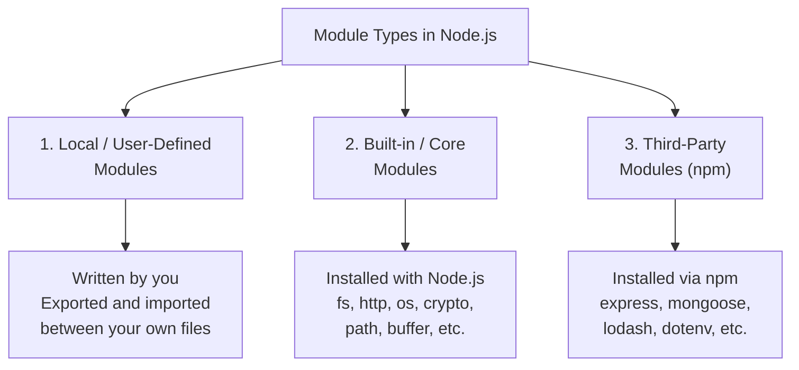
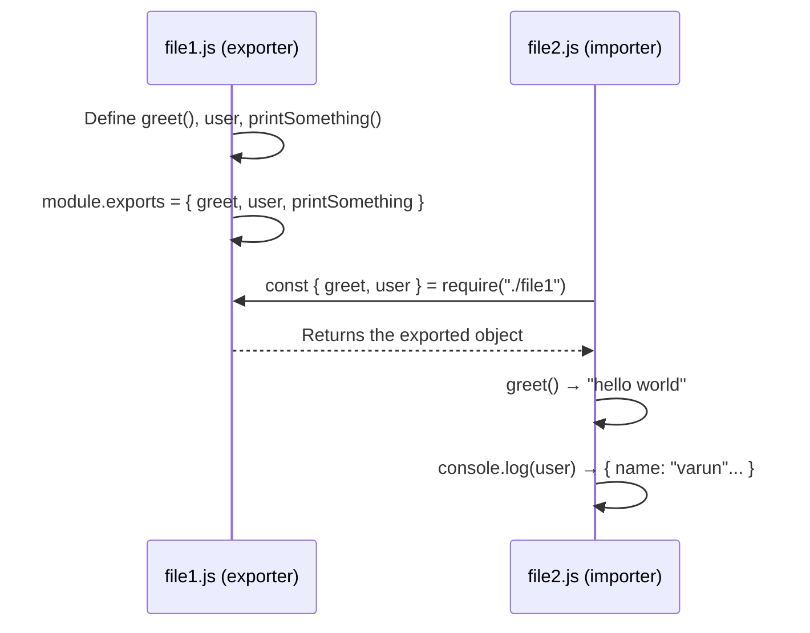
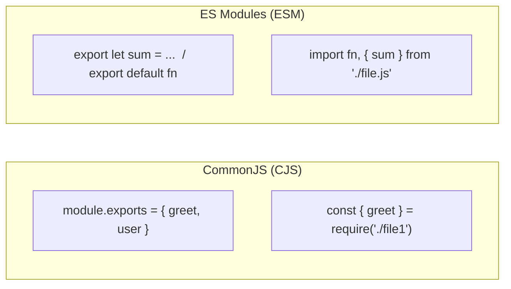

# Node.js — REPL & Module System

## Table of Contents

1. [REPL — Read, Evaluate, Print, Loop](#1-repl--read-evaluate-print-loop)
2. [Running JS Files with Node](#2-running-js-files-with-node)
3. [What are Modules?](#3-what-are-modules)
4. [Why Use Modules?](#4-why-use-modules)
5. [Types of Modules](#5-types-of-modules)
6. [Module Systems — CommonJS vs ES Modules](#6-module-systems--commonjs-vs-es-modules)
7. [CommonJS (CJS) — Export & Import](#7-commonjs-cjs--export--import)
8. [ES Modules (ESM) — Export & Import](#8-es-modules-esm--export--import)
9. [Named Export vs Default Export](#9-named-export-vs-default-export)
10. [CommonJS vs ES Modules — Full Comparison](#10-commonjs-vs-es-modules--full-comparison)
11. [Bonus — Parameters vs Arguments](#11-bonus--parameters-vs-arguments)
12. [Summary](#12-summary)
13. [Revision Checklist](#13-revision-checklist)

---

## 1. REPL — Read, Evaluate, Print, Loop

### What is REPL?

**Definition:** REPL stands for **Read, Evaluate, Print, and Loop**. It is an **interactive shell/interface** built into Node.js where you can type JavaScript commands and see the results immediately — line by line — without creating a file.

| Letter | Meaning  | What happens                            |
| ------ | -------- | --------------------------------------- |
| **R**  | Read     | Reads the input you typed               |
| **E**  | Evaluate | Evaluates / executes the JS expression  |
| **P**  | Print    | Prints the result to the terminal       |
| **L**  | Loop     | Goes back to waiting for the next input |

### How to Use REPL

```bash
# Step 1: Open terminal / command prompt
# Step 2: Type "node" and press Enter
node

# You will see the Node.js REPL prompt:
>

# Now type any JS directly:
> 2 + 2
4
> console.log("hello")
hello
> let x = 10
undefined
> x * 5
50
```

### How to Exit REPL

```bash
# Option 1: Press Ctrl + C twice
^C
^C

# Option 2: Type .exit and press Enter
> .exit
```

### When is REPL useful?

- Quickly testing a small piece of JS logic
- Checking what a method returns without creating a file
- Debugging expressions interactively
- Learning and experimenting with JS/Node APIs

---

## 2. Running JS Files with Node

### Executing a File

Instead of using REPL (interactive), you write JS in a `.js` file and run it with the `node` command.

```bash
# Syntax
node filename.js

# Extension is optional — both work:
node app.js
node app

# Examples
node index.js
node server.js
node utils
```

### Important Rule

> **The terminal must be opened/navigated to the correct directory** where the file lives. If the file path is wrong, Node will throw a `MODULE_NOT_FOUND` or `Cannot find module` error.

```bash
# Navigate to project folder first
cd /path/to/your/project

# Then run the file
node index.js
```

```javascript
// index.js
console.log("hi");

function greet() {
  console.log("hello world");
}

greet();

// Run: node index.js
// Output:
// hi
// hello world
```

---

## 3. What are Modules?

**Definition:** A module is a **reusable, self-contained piece of code** — typically a file or a group of files — that can be **exported** from one place and **imported** (used) in another.

Think of modules like **LEGO bricks** — each brick does one specific thing, and you assemble multiple bricks to build something larger. You can reuse the same brick in multiple different builds.

```
project/
├── utils.js        ← a module (defines helper functions)
├── db.js           ← a module (handles database logic)
├── auth.js         ← a module (handles authentication)
└── index.js        ← imports and uses all the above modules
```

---

## 4. Why Use Modules?

| Benefit           | Explanation                                                                                                                      |
| ----------------- | -------------------------------------------------------------------------------------------------------------------------------- |
| **Readable**      | Smaller files are easier to read and understand                                                                                  |
| **Manageable**    | Easier to update, fix bugs, or refactor one piece without touching everything                                                    |
| **Scalable**      | Easy to add new modules as the project grows                                                                                     |
| **Encapsulation** | Functions and variables inside a module are **hidden** from the outside unless explicitly exported — preventing naming conflicts |
| **DRY**           | **Don't Repeat Yourself** — write a function once, import it anywhere                                                            |

```javascript
// WITHOUT modules — all code in one massive file (bad)
// 2000 lines of mixed database logic, auth, routes, utilities...

// WITH modules — each concern in its own file (good)
// db.js       → 50 lines
// auth.js     → 80 lines
// routes.js   → 100 lines
// index.js    → 30 lines (imports and wires everything together)
```

---

## 5. Types of Modules

There are **3 types** of modules in Node.js:



---

### 5.1 Local / User-Defined Modules

Modules that **you write yourself** and make available for import/export between files in your project.

```javascript
// math.js — a local module you write
function add(a, b) {
  return a + b;
}
function subtract(a, b) {
  return a - b;
}
module.exports = { add, subtract };

// index.js — imports your local module
const { add } = require("./math");
console.log(add(2, 3)); // 5
```

---

### 5.2 Built-in / Core Modules

Modules that come **pre-installed with Node.js**. You don't need to install them — just `require` them.

| Module   | Purpose                             |
| -------- | ----------------------------------- |
| `fs`     | File system — read/write files      |
| `http`   | Create HTTP servers, make requests  |
| `os`     | Get OS info (CPU, memory, platform) |
| `crypto` | Hashing, encryption, random values  |
| `path`   | Work with file/directory paths      |
| `buffer` | Handle binary data                  |
| `qs`     | Query string parsing                |

```javascript
// Using a built-in module — no installation needed
const fs = require("fs");
const os = require("os");

console.log(os.platform()); // 'win32' or 'linux' etc.
fs.writeFileSync("hello.txt", "Hello World");
```

---

### 5.3 Third-Party Modules (npm)

Modules written by other developers and published to the **npm registry (Node Package Manager)**. You install them using `npm install`.

```bash
# Install a third-party module
npm install express
npm install mongoose
npm install dotenv
```

```javascript
// Using a third-party module after installing
const express = require("express");
const app = express();

app.get("/", (req, res) => res.send("Hello!"));
app.listen(3000);
```

---

## 6. Module Systems — CommonJS vs ES Modules

Node.js supports **two module systems**:

| Feature               | CommonJS (CJS)          | ES Modules (ESM)                                       |
| --------------------- | ----------------------- | ------------------------------------------------------ |
| **Version**           | Older (default in Node) | Newer (modern standard)                                |
| **Export keyword**    | `module.exports`        | `export`                                               |
| **Import keyword**    | `require()`             | `import`                                               |
| **File extension**    | `.js`                   | `.mjs` or `.js` with `"type":"module"` in package.json |
| **Extension in path** | Not required            | **Required**                                           |
| **Sync/Async**        | Synchronous             | Asynchronous (static analysis)                         |
| **`__dirname`**       | ✅ Available            | ❌ Use `import.meta.dirname`                           |
| **`__filename`**      | ✅ Available            | ❌ Use `import.meta.filename`                          |

---

## 7. CommonJS (CJS) — Export & Import

CommonJS is the **default module system** in Node.js. It uses `module.exports` to export and `require()` to import.

### Exporting — Single Value

```javascript
// file1.js

function greet() {
  console.log("hello world");
}

let user = { name: "varun", age: 34, id: 123 };

function printSomething() {
  console.log("something");
}

// ✅ Export a single function
module.exports = greet;

// ✅ Export a single object
// module.exports = user;

// ❌ WRONG — do NOT call the function, export the reference
// module.exports = greet()  ← this exports the RETURN VALUE, not the function
```

---

### Exporting — Multiple Values

```javascript
// file1.js

function greet() {
  console.log("hello world");
}
let user = { name: "varun", age: "34", id: 123 };
function printSomething() {
  console.log("something");
}

// ✅ Export multiple — wrap in an object
module.exports = {
  greet,
  user,
  printSomething,
};

// This is shorthand property syntax — same as:
// module.exports = { greet: greet, user: user, printSomething: printSomething }
```

---

### Importing in CommonJS

```javascript
// file2.js

// Option 1: Import the whole exported object
const value = require("./file1");

console.log(value); // { greet: [Function], user: {...}, printSomething: [Function] }
value.greet(); // "hello world"
value.printSomething(); // "something"
console.log(value.user); // { name: 'varun', age: '34', id: 123 }

// Option 2: Destructure on import (cleaner, preferred)
const { greet, user, printSomething } = require("./file1.js");

greet(); // "hello world"
printSomething(); // "something"
console.log(user); // { name: 'varun', age: '34', id: 123 }
```

> **Note:** In CommonJS, writing the file extension in the path is **not required** — `require("./file1")` and `require("./file1.js")` both work.

---

### CommonJS Flow Diagram



---

## 8. ES Modules (ESM) — Export & Import

ES Modules is the **newer, modern standard** supported natively in browsers and Node.js. It uses `export` and `import` keywords.

### Enabling ESM in Node.js

```json
// package.json — add this line to enable ESM
{
  "type": "module"
}
```

Or use `.mjs` file extension instead of `.js`.

---

### Named Exports (ESM)

Named exports allow you to export **multiple values** from a single file. Each exported value has a specific name.

```javascript
// f2.js — named exports

export let sum = (a, b) => {
  return a + b;
};

export let arr = [1.2, 3, 4];

let arr2 = [1, 2]; // NOT exported — private to this file
```

---

### Default Export (ESM)

A default export is a **single main export** from a file. Each file can have **only one** default export.

```javascript
// f2.js — default export

function greet() {
  console.log("hello");
}

export default greet;
```

---

### Combining Named + Default Exports

```javascript
// f2.js

// Named exports
export let sum = (a, b) => a + b;
export let arr = [1.2, 3, 4];

// Default export
function greet() {
  console.log("hello");
}
export default greet;
```

---

### Importing in ESM

```javascript
// main.js

// Import default export + named exports together
import greet, { arr, sum } from "./f2.js";
//     ↑               ↑
//  default        named exports (must be destructured with {})

console.log(sum(1, 2)); // 3
console.log(arr); // [1.2, 3, 4]
greet(); // "hello"
```

> **Critical Rule:** In ESM, the **file extension is required** in the import path:
>
> - ✅ `import greet from "./f2.js"`
> - ❌ `import greet from "./f2"` ← will throw an error

---

### `import.meta` — ESM Equivalent of `__dirname` / `__filename`

In CommonJS, `__dirname` and `__filename` are automatically available. In ESM, you must use `import.meta`:

```javascript
// CommonJS
console.log(__filename); // full path to current file
console.log(__dirname); // directory of current file

// ESM equivalent
console.log(import.meta.filename); // full path to current file
console.log(import.meta.dirname); // directory of current file
```

---

## 9. Named Export vs Default Export

| Feature                | Named Export                                    | Default Export                          |
| ---------------------- | ----------------------------------------------- | --------------------------------------- |
| **Syntax (export)**    | `export let x = ...`                            | `export default functionName`           |
| **How many per file?** | Unlimited                                       | **Only ONE per file**                   |
| **Import syntax**      | `import { x } from "./file.js"`                 | `import anything from "./file.js"`      |
| **Must match name?**   | ✅ Yes — must use exact exported name           | ❌ No — can use any name when importing |
| **Use case**           | Multiple utility exports (functions, variables) | The main/primary export of a module     |

```javascript
// NAMED export — imported with curly braces, name must match
export let sum = (a, b) => a + b;
export let arr = [1, 2, 3];

// Usage:
import { sum, arr } from "./math.js"; // ✅ correct
import { total } from "./math.js"; // ❌ wrong — "total" doesn't exist

// DEFAULT export — imported without curly braces, any name works
export default function greet() {
  console.log("hi");
}

// Usage:
import greet from "./greet.js"; // ✅
import sayHello from "./greet.js"; // ✅ also works — name is flexible
import { greet } from "./greet.js"; // ❌ wrong — default export isn't destructured
```

---

## 10. CommonJS vs ES Modules — Full Comparison



| Aspect                | CommonJS                       | ES Modules                          |
| --------------------- | ------------------------------ | ----------------------------------- |
| **Node default?**     | ✅ Yes                         | ❌ Need `"type":"module"` or `.mjs` |
| **Single export**     | `module.exports = value`       | `export default value`              |
| **Multiple export**   | `module.exports = { a, b }`    | `export let a = ...` (named)        |
| **Import single**     | `const val = require('./f')`   | `import val from './f.js'`          |
| **Import multiple**   | `const {a,b} = require('./f')` | `import {a,b} from './f.js'`        |
| **Extension needed?** | ❌ Optional                    | ✅ Required                         |
| **`__dirname`**       | ✅ Built-in                    | ❌ Use `import.meta.dirname`        |
| **`__filename`**      | ✅ Built-in                    | ❌ Use `import.meta.filename`       |
| **Top-level await**   | ❌ Not supported               | ✅ Supported                        |

---

## 11. Bonus — Parameters vs Arguments

A common interview question — these two terms are often confused:

| Term          | When                   | Definition                                           | Example                                           |
| ------------- | ---------------------- | ---------------------------------------------------- | ------------------------------------------------- |
| **Parameter** | During **declaration** | The variable names defined in the function signature | `function add(a, b)` → `a` and `b` are parameters |
| **Argument**  | During **invocation**  | The actual values passed when calling the function   | `add(2, 3)` → `2` and `3` are arguments           |

```javascript
// PARAMETERS — defined during declaration
function greet(name, age) {
  //             ↑     ↑
  //         parameters (placeholders)
  console.log(`Hello ${name}, you are ${age}`);
}

// ARGUMENTS — passed during invocation (calling)
greet("Varun", 34);
//     ↑         ↑
//   arguments (actual values)
```

---

## 12. Summary

| Concept                | Key Point                                                         |
| ---------------------- | ----------------------------------------------------------------- |
| **REPL**               | Interactive JS shell — type `node` in terminal to enter           |
| **Run file**           | `node filename.js` — terminal must be in correct directory        |
| **Module**             | A reusable, encapsulated piece of code                            |
| **Why modules**        | Readable, manageable, scalable, DRY, encapsulation                |
| **Local module**       | Written by you, exported/imported between your files              |
| **Built-in module**    | Comes with Node: `fs`, `http`, `os`, `crypto`, etc.               |
| **Third-party module** | Installed via npm: `express`, `mongoose`, etc.                    |
| **CommonJS**           | `module.exports` + `require()` — Node default, extension optional |
| **ESM**                | `export` + `import` — modern, extension required                  |
| **Named export**       | Multiple exports per file, must import with exact name in `{}`    |
| **Default export**     | Only one per file, can import with any name, no `{}`              |
| **Parameters**         | Variable names in function declaration                            |
| **Arguments**          | Actual values passed when calling a function                      |

---

## 13. Revision Checklist

### REPL & File Execution

- [ ] Can you explain what REPL stands for and what each letter means?
- [ ] Do you know how to enter and exit the Node REPL?
- [ ] Can you run a JS file from the terminal using `node`?
- [ ] Do you know why the terminal directory matters when running a file?

### Modules

- [ ] Can you define what a module is?
- [ ] Can you name the 4 benefits of using modules (readable, manageable, scalable, encapsulation, DRY)?
- [ ] Can you explain the 3 types of modules (local, built-in, third-party)?
- [ ] Can you name 4 built-in Node modules and what they do?

### CommonJS

- [ ] Can you export a single value using `module.exports`?
- [ ] Can you export multiple values using `module.exports = { ... }`?
- [ ] Can you import using `require()` — both full object and destructured?
- [ ] Do you know why `module.exports = greet()` is wrong (calls the function)?
- [ ] Do you know that file extension is optional in CommonJS `require()`?

### ES Modules

- [ ] Do you know how to enable ESM in a Node project?
- [ ] Can you use `export let` for named exports?
- [ ] Can you use `export default` for the default export?
- [ ] Can you write the correct `import` syntax for both named and default exports?
- [ ] Do you know that file extension is **required** in ESM import paths?
- [ ] Can you use `import.meta.filename` and `import.meta.dirname`?

### Named vs Default Export

- [ ] Can you explain the difference between named and default exports?
- [ ] Do you know that named exports must be imported with `{}` and exact names?
- [ ] Do you know that default exports can be imported with any name, without `{}`?
- [ ] Do you know each file can only have **one** default export?

### Parameters vs Arguments

- [ ] Can you explain the difference between parameters and arguments?
- [ ] Can you identify which is which in a given code snippet?

---

> **Interview tip:** When asked "What is the difference between CommonJS and ES Modules?", mention: syntax (`module.exports` vs `export`), when each is used (default Node vs modern), whether the file extension is required, and the `__dirname` vs `import.meta.dirname` difference. Bonus points for mentioning that ESM supports top-level `await` and CJS does not.
